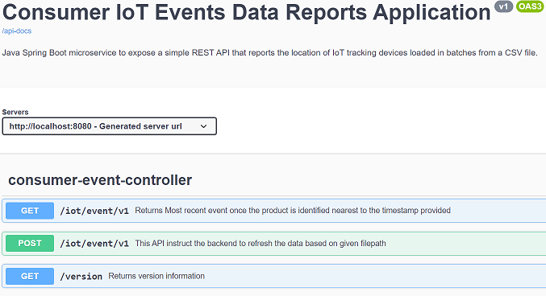
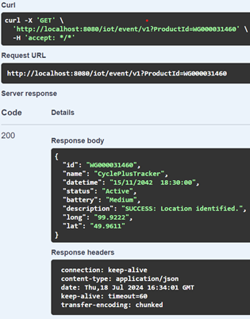

# IoT Data Solution

## Demo Consumer IoT Solution Using Csv as source and with InMemory data holder.


[![[Maven Build]](https://github.com/sitarucorp/vois-consumer-iot-api/actions/workflows/maven.yml/badge.svg)](https://github.com/sitarucorp/vois-consumer-iot-api/actions/workflows/maven.yml) [](https://github.com/sitarucorp/vois-consumer-iot-api/actions/workflows/deploy-jacoco-report-ghpages.yml) 


### Prerequisite 
* `Maven 3.9.8`
* `Java 17`
* `Intellij Ultimate/Community 2024 Edition`
* `Git for windows`

#### Checkout code
```shell
git clone https://github.com/sitarucorp/vois-consumer-iot-api.git
```
#### Local Dev To Start Application
```bash
mvn clean package spring-boot:run
```
#### Java code coverage local report
`vois-consumer-iot-api/target/site/jacoco/index.html`

### API documentation 
Swagger Endpoint can be accessible on 
```http://localhost:8080/swagger-ui/index.html```

Example :- 



API call :-




IntegrationTests are available `com.vois.consumer.iot.events.api.ConsumerEventControllerIntegrationTest`
## API calls (Demo)

#### version info
```bash
$ curl -sSi http://localhost:8080/version
HTTP/1.1 200
Content-Type: application/json
Transfer-Encoding: chunked
Date: Thu, 11 Jul 2024 15:03:59 GMT

{"version":"v1"}
```
#### Healthcheck (```http://localhost:8080/howru```)
```bash 
curl -i http://localhost:8080/howru/health # please note here consumerEventData shows size of the collection getting loaded in health checks.
{
  "status": "UP",
  "components": {
    "consumerEventData": {
      "status": "UP",
      "details": {
        "hold_by": "leader",
        "collection_size": 924
      }
    },
    "diskSpace": {
      "status": "UP",
      "details": {
        "total": 367001595904,
        "free": 361346011136,
        "threshold": 10485760,
        "path": "G:\\vois\\workspace\\vois-consumer-iot\\vois-consumer-iot-api\\.",
        "exists": true
      }
    },
    "ping": {
      "status": "UP"
    }
  }
}
```
#### Example of how we return an error
```bash
$ curl -isS localhost:8080/v1
HTTP/1.1 500
Content-Type: application/json
Transfer-Encoding: chunked
Date: Wed, 10 Jul 2024 20:38:58 GMT
Connection: close

{"timestamp":1720643938795,"status":500,"error":"Internal Server Error","path":"/v1"}

```

#### How to generate sample test data csv for the local development test
```shell

$ ./src/main/resources/gen_test_data.sh
Data generation complete. 1000000 records saved to /g/random_data.csv. size = /g/random_data.csv

```
#### Sample API call using c-url to load data:
```shell
 curl -siS -X POST -H "Content-Type: application/json" http://localhost:8080/iot/event/v1 -d '{ "filepath": "c:\\dev.csv" }'
HTTP/1.1 404
Content-Type: application/json
Transfer-Encoding: chunked
Date: Thu, 11 Jul 2024 05:16:22 GMT

{"description":"ERROR: no data file found"}
```

#### Sample API call when data is refreshed successfully
```shell
$ curl -siS -X POST -H "Content-Type: application/json" http://localhost:8080/iot/event/v1 -d '{ "filepath": "c:\\dev.csv" }'
HTTP/1.1 200
Content-Type: application/json
Transfer-Encoding: chunked
Date: Thu, 11 Jul 2024 15:04:28 GMT

{"description":"data refreshed"}
```

#### Sample API call when productId is missing
```shell
$ curl -sSi -X GET http://localhost:8080/iot/event/v1?ProductId=WG11155800
HTTP/1.1 404
Content-Type: application/json
Transfer-Encoding: chunked
Date: Thu, 11 Jul 2024 15:07:42 GMT

{"description":"ERROR: Id WG11155800 not found"}

...
Log Line:
2024-07-11T20:41:55.775+05:30 ERROR 25140 --- [vois-consumer-events-iot-api] [nio-8080-exec-1] .GlobalExceptionHandlerControllerAdvisor : [GlobalExceptionHandlerControllerAdvisor] handleResourceNotFound : Resource not found in the data : productId: WG11155800

```